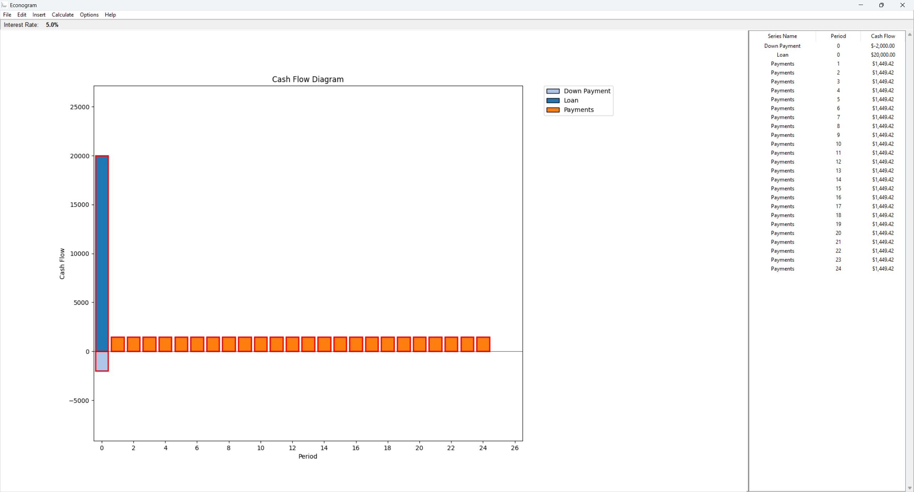

# Econogram

Econogram is a desktop application for creating and analyzing cash flow diagrams used in engineering economics. It provides a visual interface for working with time value of money calculations, including present value, future value, and annual value conversions.

## What is Econogram?

Econogram helps students and educators visualize and solve engineering economics problems. The software allows you to:

- Create cash flow diagrams with multiple series
- Insert single cash flows, uniform series, gradient series, and geometric series
- Calculate present value (PV), future value (FV), and annual value (AV) of cash flows
- Combine and manipulate cash flow series
- Export results as tables for analysis
- Work with a global interest rate that applies to all calculations

## Download

Download the latest standalone executable (.exe) from the [Releases](https://github.com/tmaier-kettering/Econogram/releases/latest) page.

No installation required - simply download and run the .exe file.

## Example

The application displays cash flows as a bar chart with periods on the x-axis and cash flow amounts on the y-axis. Different series are color-coded for easy identification.

## Help

For detailed documentation on all features, see [HELP.md](HELP.md).

## Disclaimer

This software is provided "as is" under the MIT License. While designed to assist with engineering economics education, users should verify all calculations independently. The authors are not responsible for any errors or decisions made based on the software's output.

## License

Copyright (c) 2025 Dr. Torsten Maier

Licensed under the MIT License. See [LICENSE](LICENSE) for details.
